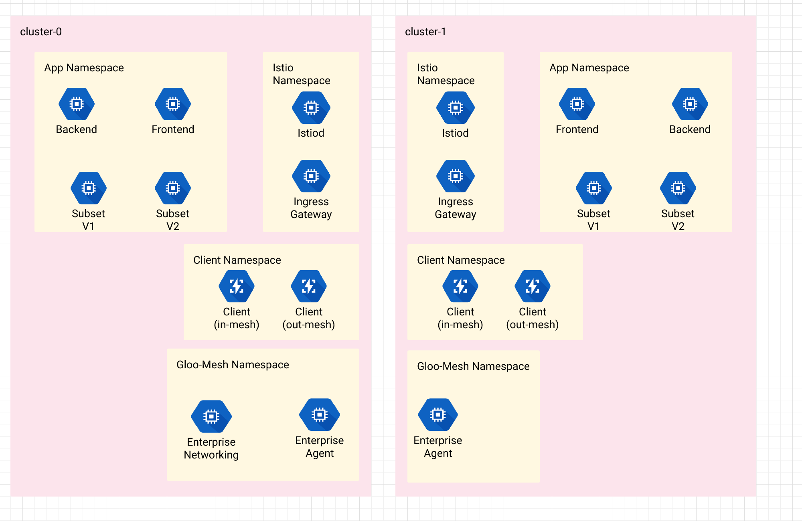
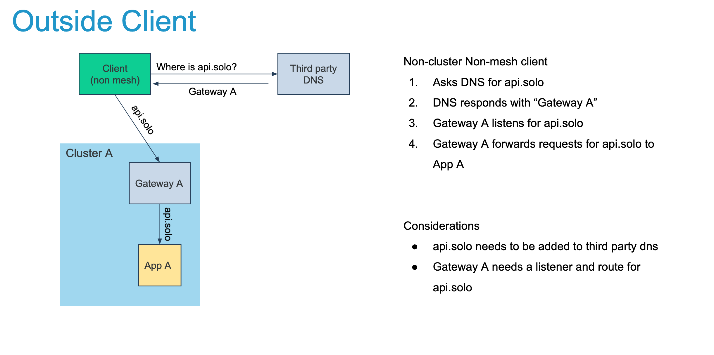
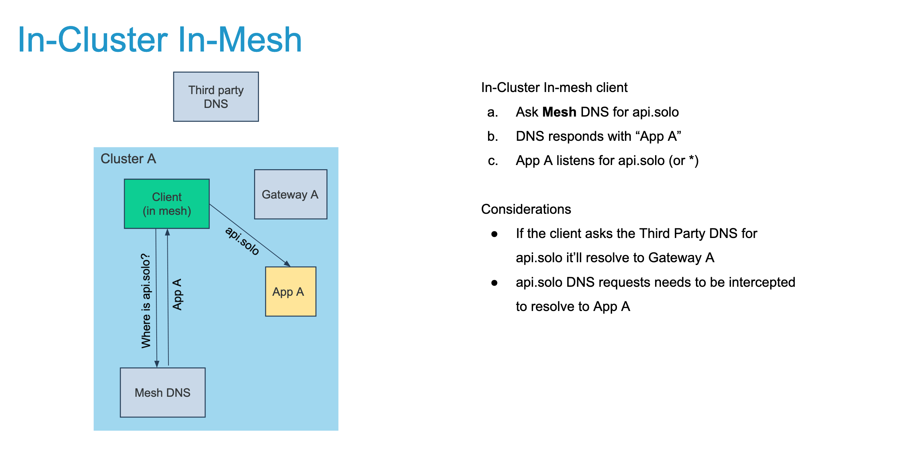
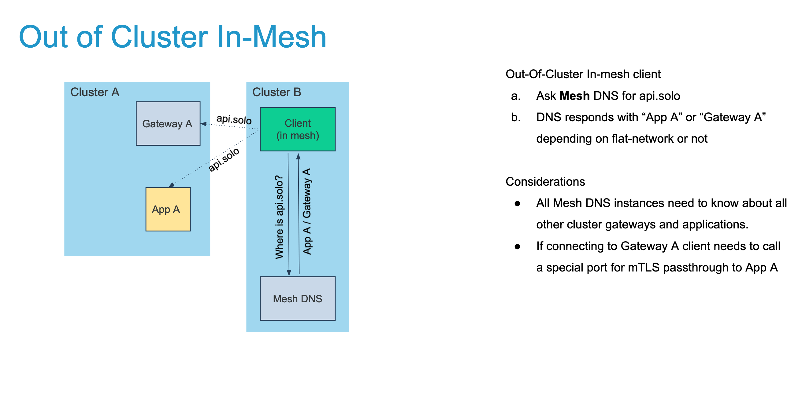
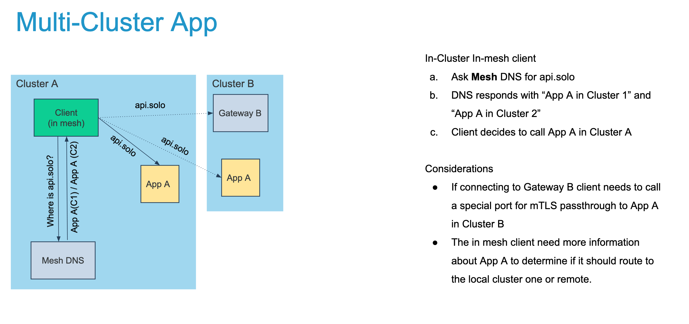
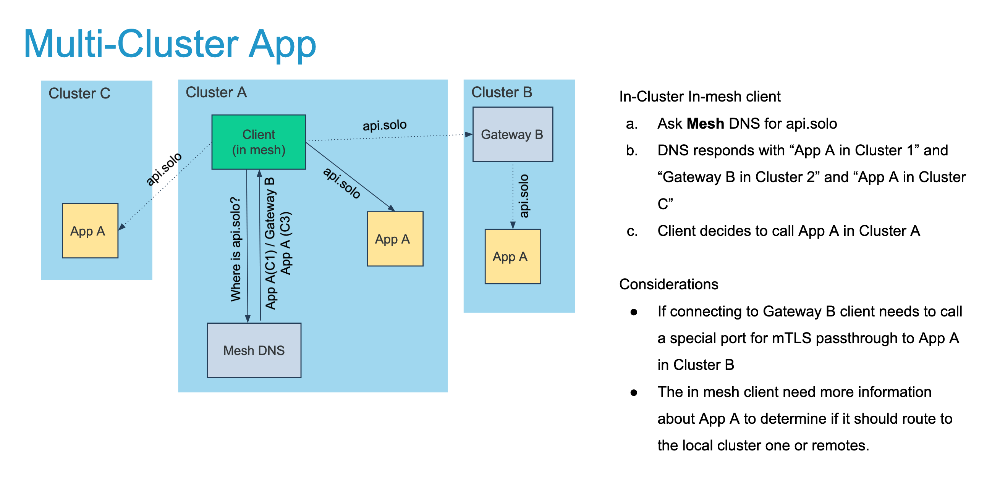
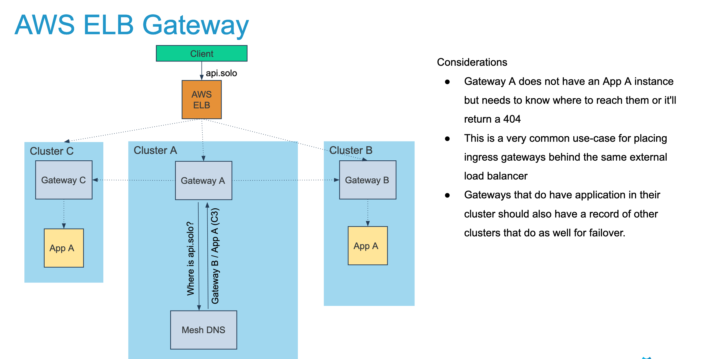
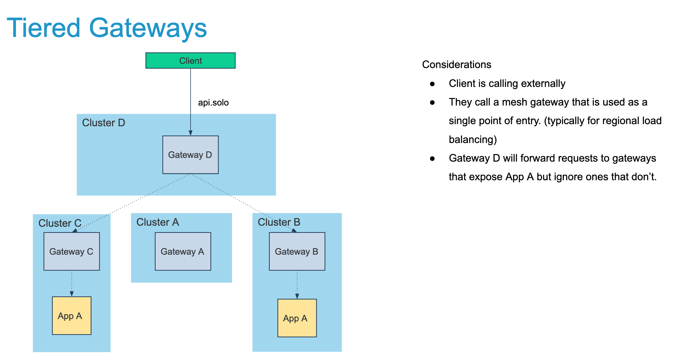

# example run of istio test framework

* currently installs istio operator based on `pkg/test/manifests/operator/gloo-mesh-istio.yaml` for every cluster provided in the kube config below.
* then installs 3 echo applications to those clusters and tests that they can talk to each other within the same cluster.

example run
```shell
FLAT_NETWORKING_ENABLED=false RUN_INTEGRATION=true GLOO_MESH_LICENSE_KEY=$GLOO_MESH_LICENSE_KEY go test -v github.com/solo-io/gloo-mesh/test/integration/multi-cluster/routing \
  -args --istio.test.kube.config=/users/nick/.kube/mp,/users/nick/.kube/cp-us-east \
  --istio.test.nocleanup=true \
  --istio.test.hub=docker.io/istio \
  --istio.test.tag=1.9.2
```

## todo
* use gm to setup routing between the two clusters and use echo calls to test it works

## cluster setup script using k3d
```sh
#!/bin/bash
network=demo-1

# create docker network if it does not exist
docker network create $network || true

## management plane cluster exposes port 9000 (unused currently)
k3d cluster create mp --image "rancher/k3s:v1.20.2-k3s1"  --k3s-server-arg "--disable=traefik" --network $network
kube_ctx=k3d-mp
k3d kubeconfig get mp > ~/.kube/mp

kubectl label node $kube_ctx-server-0 topology.kubernetes.io/region=us-west-1 --context $kube_ctx
kubectl label node $kube_ctx-server-0 topology.kubernetes.io/zone=us-west-1b --context $kube_ctx

## control plane cluster (us-east) exposes port 9010 (unused currently)
k3d cluster create cp-us-east --image "rancher/k3s:v1.20.2-k3s1"  --k3s-server-arg "--disable=traefik" --network $network
k3d kubeconfig get cp-us-east > ~/.kube/cp-us-east
kube_ctx=k3d-cp-us-east

kubectl label node $kube_ctx-server-0 topology.kubernetes.io/region=us-east-1 --context $kube_ctx
kubectl label node $kube_ctx-server-0 topology.kubernetes.io/zone=us-east-1a --context $kube_ctx

```

### teardown
```shell
#!/bin/bash
network=demo-1
k3d cluster delete mp
rm  ~/.kube/mp
  
k3d cluster delete cp-us-east
rm  ~/.kube/cp-us-east

docker network rm $network

```


## Cluster / App Topology
This is the default deployment of the test engine. there are no assumptions about the connectivity of the applications.
Each test will determine the routing between them. 



## Use Cases


### Outside client
The client is outside the cluster and outside the mesh. They need to rely on third party DNS to resolve a gateway that hosts the API.



### In-Cluster In-Mesh
The client is inside the same cluster as the application and is a part of the mesh.



### Outside cluster In-Mesh
The client is a part of the mesh but does not contain a target application in its local cluster

  

### Multi-Cluster Application 
The application exists in many clusters.



### Multi-Cluster Application Hybrid Topology 
The application exists in many clusters but some are flat networks and some require ingress gateways.



### Multi-Cluster Application With ELB 
The application exists in many clusters but not all. The ELB will still route requests to clusters without an application. 


  
### In-Cluster Out of Mesh 
The client is in the same cluster as the application but not a part of the mesh. 

  

### Tiered Gateways 
Gateway that routes to other gateways within the mesh.

  

### Egress Gateways 
Routing egress traffic through a specified gateway
